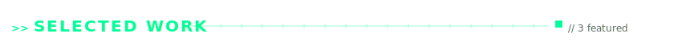
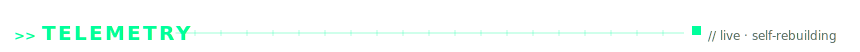
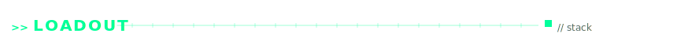
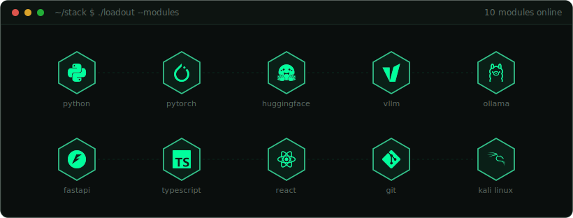
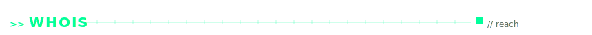

<!--
  github.com/KuantumKnight — profile readme
  the visuals are SVGs under assets/, generated by .github/workflows/profile.yml.
  edit copy here; edit visuals in scripts/. all four data panels self-update.
-->

  

  <code>builds products</code> &nbsp;·&nbsp; <code>then breaks them</code> &nbsp;·&nbsp; <code>sometimes other people's, with permission</code>

 

<!-- ───────────────── selected work ───────────────── -->

  

  

  

<!-- ───────────────── telemetry (live) ───────────────── -->

  
  &nbsp;
  

  

<!-- ───────────────── loadout / stack ───────────────── -->

<!-- ───────────────── whois / reach ───────────────── -->

  
  &nbsp;
  
  &nbsp;
  

<!--
  add when the accounts have real activity — empty beats fake:
  x → https://x.com/handle · htb → app.hackthebox.com/users/… · ctftime → ctftime.org/user/…
-->

 

  
  this readme builds itself. the console, feed, contribution scan, and hologram above are real — regenerated on a schedule by a github action i wrote (<a href="https://github.com/KuantumKnight/KuantumKnight/blob/main/.github/workflows/profile.yml"><code>.github/workflows/profile.yml</code></a>) that renders its own svgs in python. no third-party widgets. no template.
  

