<!--
  Custom animated terminal header — header.svg is hand-authored (inline CSS @keyframes).
  Place header.svg at the repo root next to this README.
-->

  
  
  
  

 

## <samp>`//` featured work</samp>

| Project | What it is | Stack |
|:--|:--|:--|
| [**BugBouncer**](https://github.com/KuantumKnight/bugbouncer) `★65` | Local-first stability engine that detects invisible architectural failures in modern SaaS apps — and hands you the fix | `Next.js 16` · `React 19` · `TS strict` · `SQLite WASM` |
| [**ZeroDay Heist Writeups**](https://github.com/KuantumKnight/ZeroDayHeist_CTF_Writeups) | Full writeups — 17 challenges, 5 categories, 2026 community CTF | `Forensics` · `RE` · `OSINT` · `Stego` · `Crypto` |
| [**SNTE**](https://github.com/KuantumKnight/snte-wasm) | Smart Notification Throttling Engine — DSA in pure C, compiled to WASM, deployed live | `C` · `WebAssembly` · `Emscripten` |
| [**Synthetix**](https://github.com/KuantumKnight/Synthetix) | Duplicate-defect finder & bug-report enhancer | `Python` · `NLP` |
| [**VulnScanner**](https://github.com/KuantumKnight/Vulnscanner) | Automated vulnerability scanner | `Python` · `Security` |

 

## <samp>`//` stack</samp>

  
  
  
  
  
  
  
  
  
  
  
  

 

## <samp>`//` activity</samp>

  
  

<!-- contribution graph -->

  

<!-- snake animation — generated by the GitHub Action below, committed to the `output` branch -->

  

 

  

