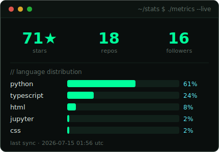
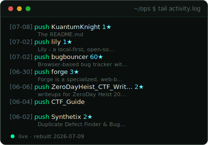

<!--
  github.com/KuantumKnight — profile readme
  this file is mostly hand-written. the four svgs under assets/ are generated
  by .github/workflows/profile.yml. edit copy here; edit visuals in scripts/.
-->

  

  <code>builds products</code> &nbsp;·&nbsp; <code>then breaks them</code> &nbsp;·&nbsp; <code>sometimes other people's, with permission</code>

 

## `$ ls ~/selected-work`

three things worth your time. the rest is in [pinned](https://github.com/KuantumKnight?tab=repositories).

**[bugbouncer](https://github.com/KuantumKnight/bugbouncer)** &nbsp; `65★` &nbsp; `ts · next.js · sqlite-wasm`
local-first stability engine. catches the architectural failures your tests can't see, then hands you the fix. runs entirely in the browser.

**[synthetix](https://github.com/KuantumKnight/Synthetix)** &nbsp; `python`
finds duplicate defects and rewrites weak bug reports into ones engineers actually act on. less noise, faster triage.

**[zeroday heist · writeups](https://github.com/KuantumKnight/ZeroDayHeist_CTF_Writeups)** &nbsp; `17 flags`
forensics, reverse engineering, osint, steganography, crypto. full notes, not just flags.

 

## `$ uptime --live`

<!-- regenerated on a schedule by the action. real numbers, not a widget. -->

  
  &nbsp;
  

  

 

## `$ cat stack.txt`

`python` &nbsp; `typescript` &nbsp; `c → wasm` &nbsp; `next.js` &nbsp; `react` &nbsp; `flask`
`kali` &nbsp; `wireshark` &nbsp; `ghidra` &nbsp; `burp` &nbsp; `git`

 

## `$ whois sarvesh`

`github` &nbsp;→&nbsp; [@KuantumKnight](https://github.com/KuantumKnight)
`email` &nbsp;→&nbsp; sarveshmknight@gmail.com
`linkedin` &nbsp;→&nbsp; [s4rv3sh-m](https://www.linkedin.com/in/s4rv3sh-m)

<!--
  add when the accounts have real activity on them — empty beats fake:
  `x`       → [@handle](https://x.com/handle)
  `htb`     → [profile](https://app.hackthebox.com/profile/xxxxx)
  `ctftime` → [profile](https://ctftime.org/user/xxxxx)
-->

 

---

this readme builds itself. the console, feed, and contribution radar above are real — regenerated on a schedule by a github action i wrote (<a href="https://github.com/KuantumKnight/KuantumKnight/blob/main/.github/workflows/profile.yml"><code>.github/workflows/profile.yml</code></a>) that renders its own svgs with python. no third-party stat widgets. no template.

