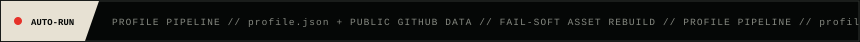

<!--
  github.com/KuantumKnight — animated profile README
  Edit identity, projects, stack, and links in profile.json.
  Edit visual behavior in scripts/. Generated output lives in assets/.
-->

  

<!-- selected work -->

  

  

  

<!-- field notes -->

  

  

  

<!-- live public GitHub data -->

  
  

  

<!-- working set -->

<!-- contact -->

  
  
  

  

