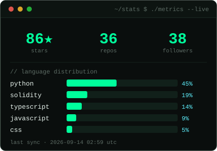
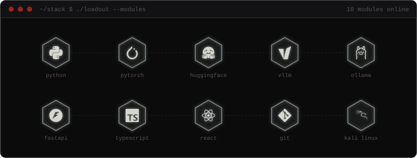

<!--
  github.com/KuantumKnight — profile README
  Edit identity, projects, stack, and links in profile.json.
  Edit visual behavior in scripts/. Generated output lives in assets/.
-->

  

<!-- selected work -->

  
  
  

<!-- field notes -->

  <a href="https://github.com/KuantumKnight/BLACKBOX_Writeups"><code>BLACKBOX WRITEUPS</code></a>
  &nbsp;·&nbsp; six-module engineering challenge, 6/6 complete
   
  <a href="https://github.com/KuantumKnight/ZeroDayHeist_CTF_Writeups"><code>ZERODAY HEIST</code></a>
  &nbsp;·&nbsp; 17 CTF writeups across forensics, RE, OSINT, steg, and crypto
   
  <a href="https://github.com/KuantumKnight/Synthetix"><code>SYNTHETIX</code></a>
  &nbsp;·&nbsp; duplicate-defect finder and bug-report enhancer

<!-- live public GitHub data -->

  
  

  

<!-- working set -->

<!-- contact -->

  
  &nbsp;
  
  &nbsp;
  

  
    Profile assets are rendered from <code>profile.json</code> and public GitHub data by
    <a href="https://github.com/KuantumKnight/KuantumKnight/blob/main/.github/workflows/profile.yml"><code>profile.yml</code></a>.
    If a data source is unavailable, the last successful asset is preserved.
  

